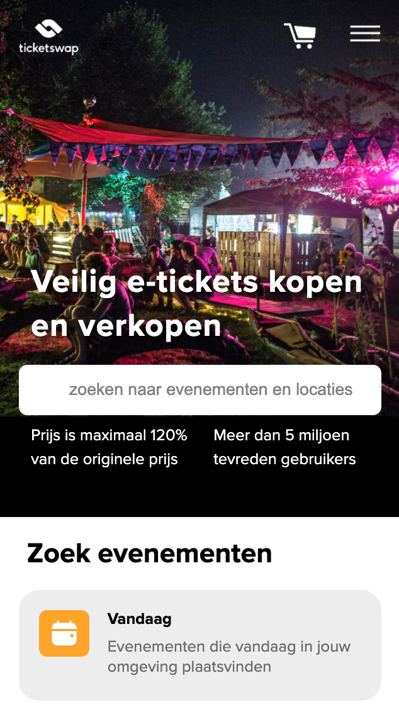
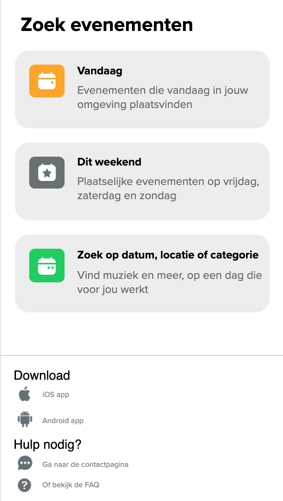
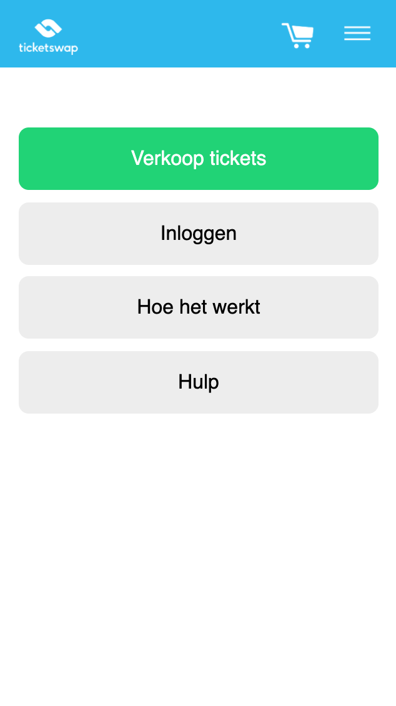
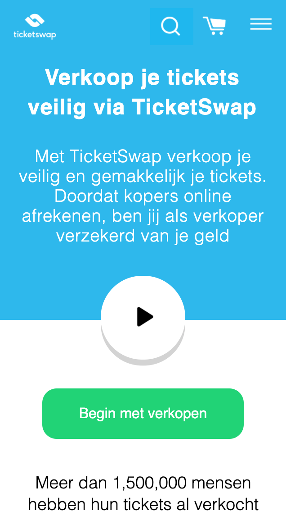
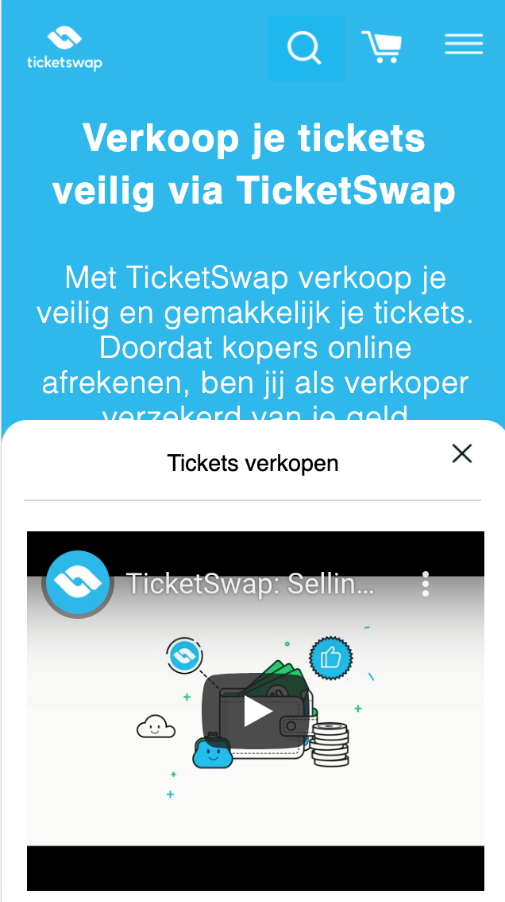
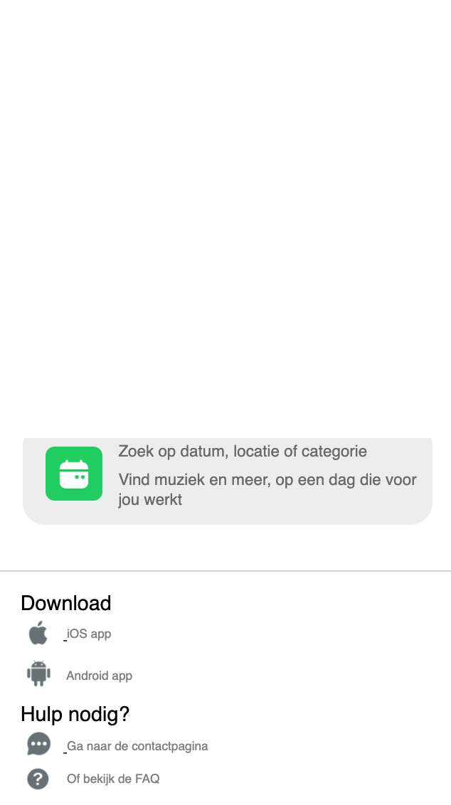
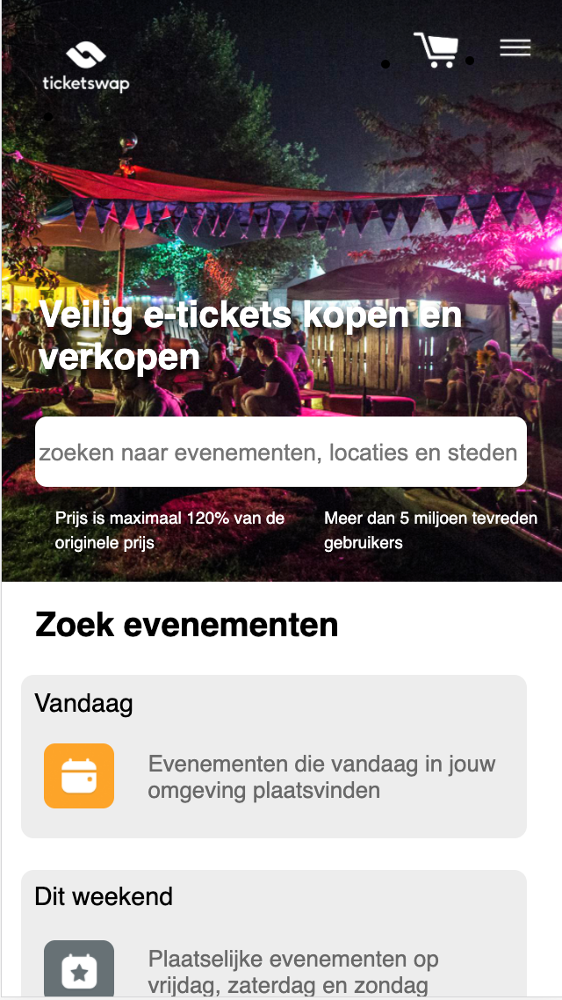
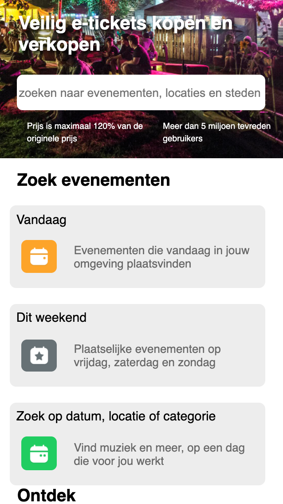

# Procesverslag
**Auteur:** -Benthe van Steijn-

Markdown cheat cheet: [Hulp bij het schrijven van Markdown](https://github.com/adam-p/markdown-here/wiki/Markdown-Cheatsheet). Nb. de standaardstructuur en de spartaanse opmaak zijn helemaal prima. Het gaat om de inhoud van je procesverslag. Besteedt de tijd voor pracht en praal aan je website.

## Bronnenlijst
1. css-tricks.com
2. klasgenoten 
3. w3schools voor enkel voorbeelden van hoe een tag geschreven moet worden

## Eindgesprek (week 7/8)

Mijn eerste keuze was het maken van een responsive website. Nu heb ik toch gekozen voor de Surface laag, omdat ik het leuker vind om met losse elementen te spelen en deze interactie te zien. Ik heb daarom veel gewerkt met de states en enkele animaties toegevoegd (zoals winkelwagen, uitschuifmenu en video). 
Ik heb heel lang(bijna 3 dagen.....) lopen stoeien met het openen van het filmpje op de tweede pagina. Javascript vind ik heel erg moeilijk dus heb hier veel hulp van Sophie en Tim gehad. Ik kreeg hierdoor meer inzicht over de Javascript waardoor ik nu precies weet hoe het werkt. Hierdoor heb ik zelf, met enige hulp, dit voor elkaar gekregen, erg blij! 

**Screenshot(s):**

## Voortgang 3 (week 6)

### Stand van zaken
Tegen heel wat dingen aangelopen. Het responsive maken van de website gaat mij niet goed af, ik kan bijvoorbeeld kleuren veranderen maar de groottes van bijvoorbeeld de form veranderd niet. Ik probeer dit met mediaqueries. 

Het maken van een uitklapbaar hamburgermenu lukt ook nog niet, veel hulp gekregen van een klasgenoot (Jody), maar het is mij nog niet gelukt. Dit ga ik vragen in het voortganggesprek. 

Het is me wel vrij soepel gelukt om een footer te maken, deze 'wat simpelere' dingen gaan gelukkig steeds vloeiender, hierdoor denk ik dat de tweede pagina sneller gaat lukken. 

**Screenshot(s):**

Hier ziet u hoe het uitklapmenu vast staat, ik ga dit oplossen tijdens het voortgangsprek. 

### Agenda voor meeting

We beginnen om 13:40 
Benthe
Fleur
Denzel
Arthur
Jody

### Verslag van meeting

Ik willen het hebben over:

- Media queries (responsive maken)
- Hamburger uitklapmenu

## Voortgang 2 (week 5)

### Stand van zaken

Het ging voor mij een stuk makkelijker dan bij de vorige voortgang. Ik herinnerde me nog veel dingen van vorig jaar waardoor ik in een goede werkflow kwam. Ik heb wel steeds samengezeten met klasgenoten om aan de website te werken, hierdoor konden wij elkaar helpen en ging het bij ons allemaal een stuk sneller. Het lijkt misschien alsof ik niet veel verder ben gekomen als jullie de schermen zien, maar mijn code is ten opzichte van vorige keer meer opgeruimd en netjes. Ook heb ik mijn eerste pagina wat uitgebreid met knoppen en linkjes, hier was ik nog wel enige tijd mee bezig.

**Screenshot(s):**

### Agenda voor meeting

We beginnen om 13:40 
Benthe
Fleur
Denzel
Arthur
Jody

### Verslag van meeting

Wij willen het hebben over:

- Forms
- Positioneren (mingetallen)
- Wanneer maak je gebruik van flex of grid?

## Voortgang 1 (week 3)

### Stand van zaken

Het opzetten van mijn bestanden en het begin maken ging ontzettend moeizaam. Ik moest weer een beetje aan het programmeren wennen, maar door het te doen viel alles weer een beetje op zijn plek. Door hulp van studiegenoten heb ik er wat van kunnen maken. Het ziet er uit als een klein beetje, maar ik heb hier echt uren aan gewerkt. Ik had vooral veel moeite met de nav bar.

**Screenshot(s):**

### Agenda voor meeting

We beginnen om 13:40 
Benthe
Fleur
Denzel
Arthur
Jody

### Verslag van meeting

We hebben gekeken naar iedereen zijn/haar vooruitgang. Niet iedereen was al begonnen en niemand was nog heel ver, hierdoor hebben we de vooruitgang nog niet helemaal kunnen bespreken. Iedereen vertelde wel waar de moeilijkheden zaten. Namelijk bij HTML zelf (wanneer is iets een link en wanneer is iets een button) Javascript, CSS (het aangeven van left/right wat soms niet werkt), Forms en nog meer. 

De personen die al kunnen coderen hebben ons een beetje opweg geholpen waardoor de blauwe piste wat vooruit kwam. 

## Intake (week 1)

**Je startniveau:** -Blauwe piste-

**Je focus:** -Surface layer-

**Je opdracht:** -https://www.ticketswap.nl/-

**Screenshot(s):**

, 
, 
, 
, 
, 
, 
 

**Breakdown-schets(en):**

