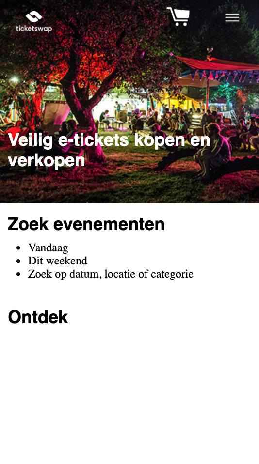
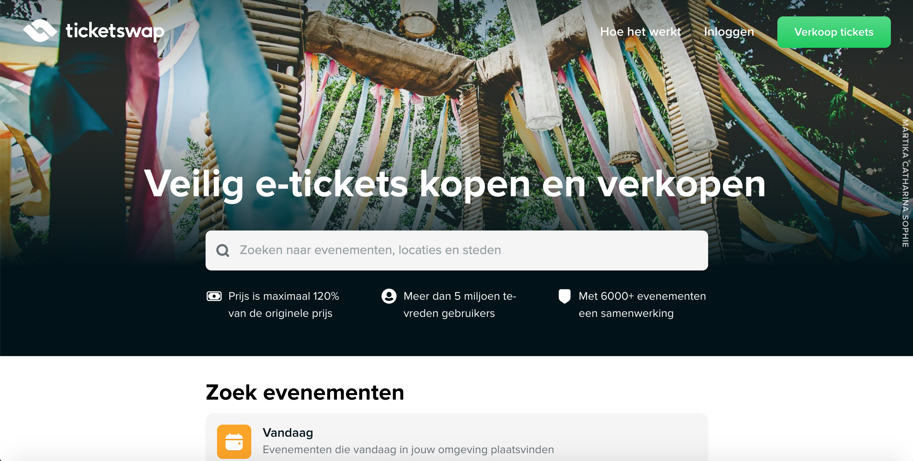
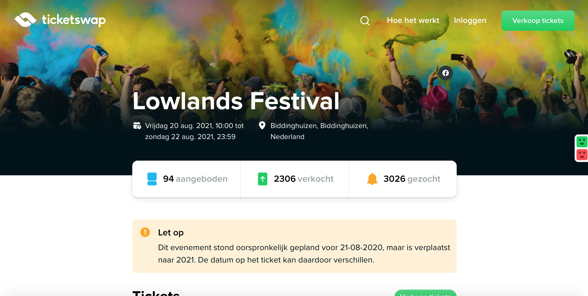
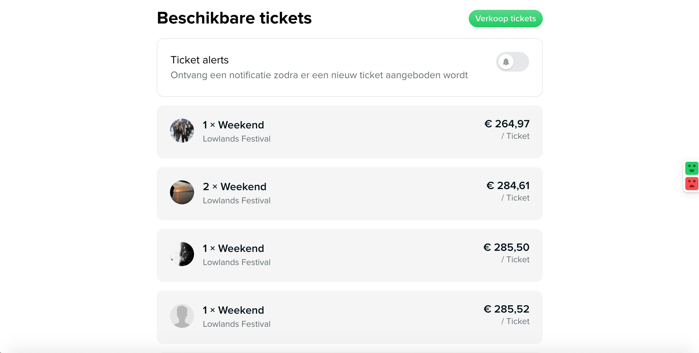
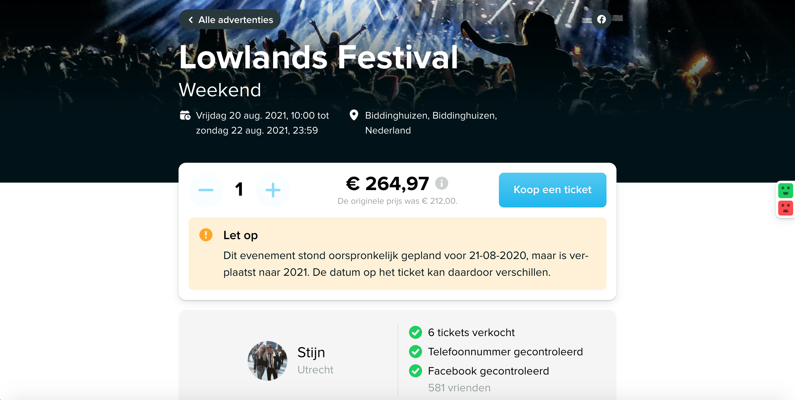
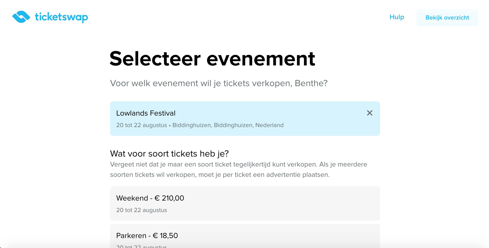
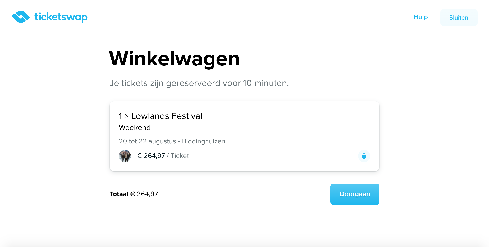
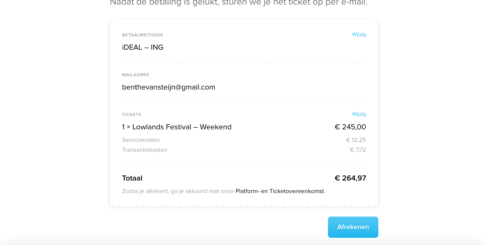
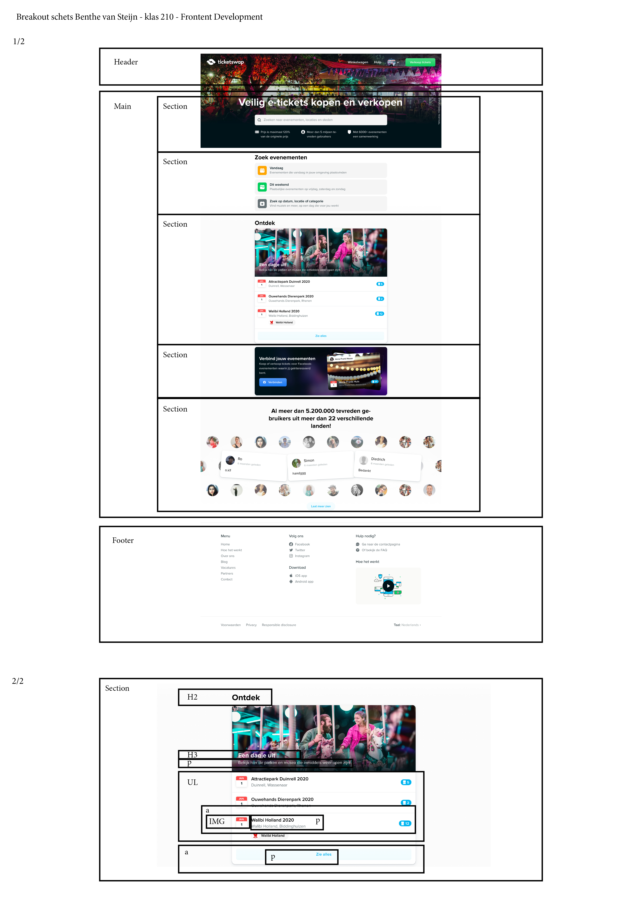

# Procesverslag
**Auteur:** -Benthe van Steijn-

Markdown cheat cheet: [Hulp bij het schrijven van Markdown](https://github.com/adam-p/markdown-here/wiki/Markdown-Cheatsheet). Nb. de standaardstructuur en de spartaanse opmaak zijn helemaal prima. Het gaat om de inhoud van je procesverslag. Besteedt de tijd voor pracht en praal aan je website.

## Bronnenlijst
1. -bron 1-
2. -bron 2-
3. -...-

## Eindgesprek (week 7/8)

-dit ging goed & dit was lastig-

**Screenshot(s):**

-screenshot(s) van je eindresultaat-

## Voortgang 3 (week 6)

-same as voortgang 1-

## Voortgang 2 (week 5)

-same as voortgang 1-

## Voortgang 1 (week 3)

### Stand van zaken

Het opzetten van mijn bestanden en het begin maken ging ontzettend moeizaam. Ik moest weer een beetje aan het programmeren wennen, maar door het te doen viel alles weer een beetje op zijn plek. Door hulp van studiegenoten heb ik er wat van kunnen maken. Het ziet er uit als een klein beetje, maar ik heb hier echt uren aan gewerkt. Ik had vooral veel moeite met de nav bar.

**Screenshot(s):**

### Agenda voor meeting

We beginnen om 13:40 
Benthe
Fleur
Denzel
Arthur
Jody

### Verslag van meeting

We hebben gekeken naar iedereen zijn/haar vooruitgang. Niet iedereen was al begonnen en niemand was nog heel ver, hierdoor hebben we de vooruitgang nog niet helemaal kunnen bespreken. Iedereen vertelde wel waar de moeilijkheden zaten. Namelijk bij HTML zelf (wanneer is iets een link en wanneer is iets een button) Javascript, CSS (het aangeven van left/right wat soms niet werkt), Forms en nog meer. 

De personen die al kunnen coderen hebben ons een beetje opweg geholpen waardoor de blauwe piste wat vooruit kwam. 

## Intake (week 1)

**Je startniveau:** -Blauwe piste-

**Je focus:** -Responsive-

**Je opdracht:** -https://www.ticketswap.nl/-

**Screenshot(s):**

, 
, 
, 
, 
, 
, 
 

**Breakdown-schets(en):**

